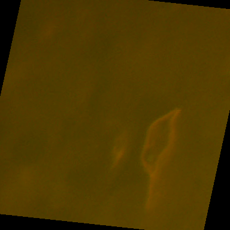
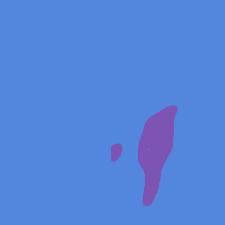

# 🔬 Stranger Sections 2


The challenge is focused on the micrometer scale analysis of geosciences, specifically targeting the segmentation and classification of kerogen macerals in thin section images of rocks. Participants are provided with labeled training data to develop machine learning models capable of identifying three types of kerogen: liptinite, vitrinite, and inertinite. These models must segment and classify the kerogens based on their unique characteristics under reflected light microscopy. The challenge includes a test set for evaluation and additional unlabeled images for further model training or testing. The primary evaluation metric is the Jaccard Score, rewarding models that accurately segment and classify the kerogen types, which is crucial for understanding sedimentary rocks and searching for new hydrocarbon reserves.

This project was made possible by our compute partners [2CRSi](https://2crsi.com/) and [NVIDIA](https://www.nvidia.com/).

## 🏆 Challenge ranking
The score of the challenge was a micro DICE coefficient.  
Our solution was the top 10% (out of 296 teams) with a micro DICE coefficient equal to 0.5844 🎉.

Leaderboard podium:  
🥇 Sheoran - 0.6672  
🥈 flamethrower - 0.6615   
🥉 V P - 0.6588 

## 🖼️ Result example

Input image | Ground thruth | Our prediction
:--------------------:|:--------------------:|:--------------------:|
 |  | 

## 🔬 References

Zhang, Y., Cheng, Y., & Qi, Y. (2023). SemiSAM: Exploring SAM for Enhancing Semi-Supervised Medical Image Segmentation with Extremely Limited Annotations. arXiv preprint arXiv:2312.06316.

Jiao, R., Zhang, Y., Ding, L., Xue, B., Zhang, J., Cai, R., & Jin, C. (2023). Learning with limited annotations: a survey on deep semi-supervised learning for medical image segmentation. Computers in Biology and Medicine, 107840.

Li, N., Xiong, L., Qiu, W., Pan, Y., Luo, Y., & Zhang, Y. (2023, November). Segment anything model for semi-supervised medical image segmentation via selecting reliable pseudo-labels. In International Conference on Neural Information Processing (pp. 138-149). Singapore: Springer Nature Singapore.

Chen, T., Mai, Z., Li, R., & Chao, W. L. (2023). Segment anything model (sam) enhanced pseudo labels for weakly supervised semantic segmentation. arXiv preprint arXiv:2305.05803.

Peláez-Vegas, A., Mesejo, P., & Luengo, J. (2023). A survey on semi-supervised semantic segmentation. arXiv preprint arXiv:2302.09899.

## 📝 Citing

```
@misc{RebergaUrgell:2024,
  Author = {Louis Reberga and Baptiste Urgell},
  Title = {Stranger Sections 2},
  Year = {2024},
  Publisher = {GitHub},
  Journal = {GitHub repository},
  Howpublished = {\url{https://github.com/association-rosia/segmenting-subsurface}}
}
```

## 🛡️ License

Project is distributed under [MIT License](https://github.com/association-rosia/segmenting-subsurface/blob/main/LICENSE)

## 👨🏻‍💻 Contributors

Louis
REBERGA <a href="https://twitter.com/rbrgAlou"></a> <a href="https://www.linkedin.com/in/louisreberga/"></a> <a href="louis.reberga@gmail.com"></a>

Baptiste
URGELL <a href="https://twitter.com/Baptiste2108"></a> <a href="https://www.linkedin.com/in/baptiste-urgell/"></a> <a href="baptiste.u@gmail.com"></a> 
